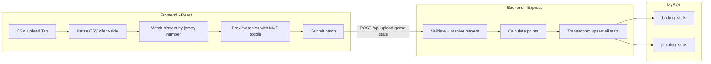

# GameChanger CSV Upload Feature

## Architecture Overview

## Key Design Decisions

- **CSV parsing happens client-side** using PapaParse (robust handling of quoted fields, edge cases). No file upload to the server -- only the parsed, mapped JSON payload is sent.
- **Player matching by jersey number** against active players only. The frontend fetches `/api/active-players` and matches on `jerseyNumber`. Unmatched players get a dropdown for manual mapping.
- **Duplicate column names** (H, BB, SO, HBP appear in both Batting and Pitching sections): resolved by using the category header row (row 0) to determine section boundaries, then indexing columns within each section.
- `**at_bats`** is a generated column in MySQL -- we do NOT insert it.
- `**batting_points`** is calculated server-side using the existing `calculateBattingPoints()` function.
- `**pitching_points`** is auto-computed in the DB -- we do NOT insert it.
- **SAC + SF** from the CSV are combined into the `sacs` DB column.
- **IP to outs conversion**: Baseball notation "2.1" = 7 outs. Formula: `Math.floor(ip) * 3 + Math.round((ip % 1) * 10)`.
- **Filtering**: Skip rows where `Number` is "Totals" or empty. For batting, only include players with PA > 0. For pitching, only include players with IP > "0.0".

## CSV-to-DB Column Mapping

**Batting** (CSV section starting at "Batting" category header):

- `PA` -> `plate_appearances`
- `1B` -> `singles`
- `2B` -> `doubles`
- `3B` -> `triples`
- `HR` -> `home_runs`
- `R` -> `runs_scored`
- `RBI` -> `rbi`
- `BB` -> `walks`
- `SO` -> `strikeouts`
- `HBP` -> `hit_by_pitch`
- `SAC` + `SF` -> `sacs`
- `SB` -> `stolen_bases`
- `CS` -> `caught_stealing`

**Pitching** (CSV section starting at "Pitching" category header):

- `IP` -> `outs_recorded` (converted from baseball notation)
- `#P` -> `pitches_thrown`
- `H` -> `hits_allowed`
- `R` -> `runs_allowed`
- `ER` -> `earned_runs`
- `SO` -> `strikeouts`
- `BB` -> `walks_allowed`
- `HBP` -> `hit_batters`
- `W` -> `w`
- `L` -> `l`
- `SV` -> `save_earned`

## Files to Modify

### 1. New file: `[my-app/src/components/CsvUploadForm.tsx](my-app/src/components/CsvUploadForm.tsx)`

New React component containing the entire CSV upload workflow:

- **Step 1 -- Game Selection**: Season dropdown + game dropdown (reuses existing patterns from admin.tsx)
- **Step 2 -- File Upload**: Drag-and-drop or click-to-browse file input. On selection, parse CSV with PapaParse, extract section boundaries from category row, map columns.
- **Step 3 -- Player Matching Table**: Shows each CSV player row with:
  - Jersey number, CSV name, matched DB player name (or a red "Unmatched" badge with a dropdown of active players)
  - All rows must be matched before proceeding
- **Step 4 -- Stats Preview**: Two collapsible tables (Batting Stats, Pitching Stats) showing the parsed values mapped to DB column names. Each row has an MVP checkbox toggle.
- **Step 5 -- Submit**: Sends the payload to the new batch endpoint. Shows success/error feedback.

### 2. Modify: `[my-app/src/admin.tsx](my-app/src/admin.tsx)`

- Import and render `CsvUploadForm` as a new tab called "CSV 업로드"
- Add a new tab button after the existing "투구 기록" button
- Pass `seasons`, `activePlayers`, `adminToken`, and `API_BASE_URL` as props
- Load active players and games data when this tab is selected

### 3. Modify: `[server/index.js](server/index.js)`

Add a new bulk endpoint `POST /api/upload-game-stats` (admin-protected):

- **Request body**: `{ gameId, battingStats: [{ playerId, ...stats }], pitchingStats: [{ playerId, ...stats }] }`
- **Validation**: Verify gameId exists; verify all playerIds are active players
- **Transaction**: Within a single MySQL transaction:
  - For each batting stat row: calculate `batting_points` using existing `calculateBattingPoints()`, then upsert (try UPDATE, fallback INSERT -- same pattern as existing endpoints)
  - For each pitching stat row: upsert (same pattern)
- **Response**: `{ ok: true, inserted: { batting: N, pitching: M } }`

### 4. Add dependency: PapaParse

- Install `papaparse` and `@types/papaparse` in the frontend

## UI Flow (User Experience)

1. Manager navigates to "CSV 업로드" tab
2. Selects a season from the dropdown, then selects a game
3. Clicks "파일 선택" or drags a `.csv` file onto the drop zone
4. System instantly parses the CSV and shows the player matching table
5. Green checkmarks for matched players; unmatched players show a warning with a dropdown to manually assign
6. Once all players are matched, two preview tables appear (batting + pitching) with an MVP checkbox per row
7. Manager reviews, optionally checks MVP for a standout player, then clicks "기록 등록"
8. Success message confirms how many records were inserted

